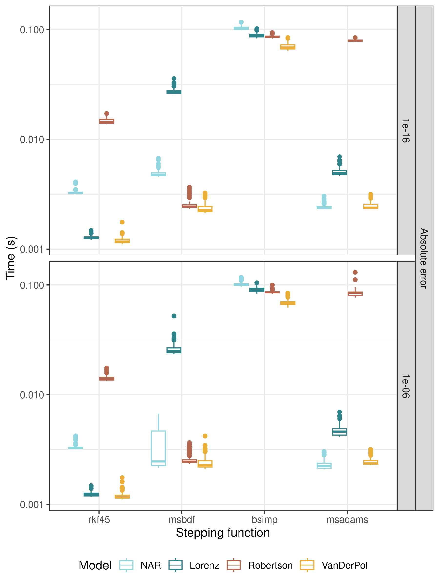
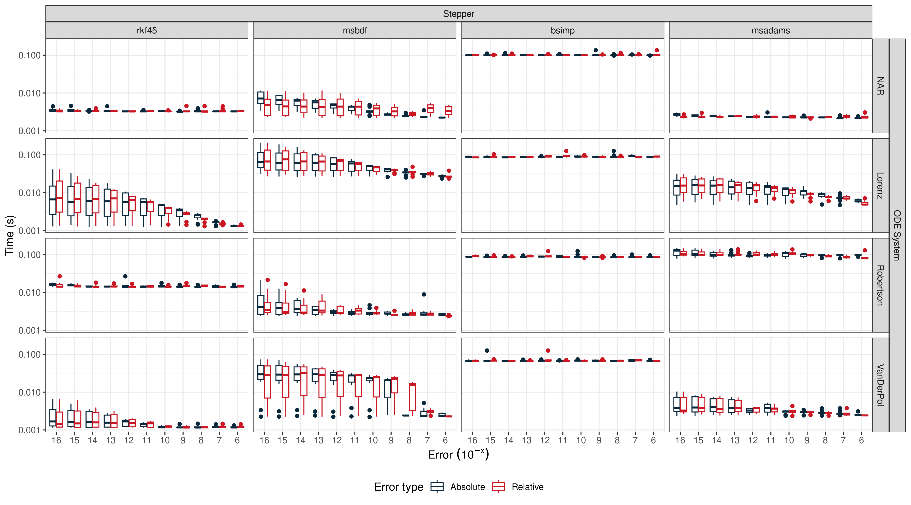
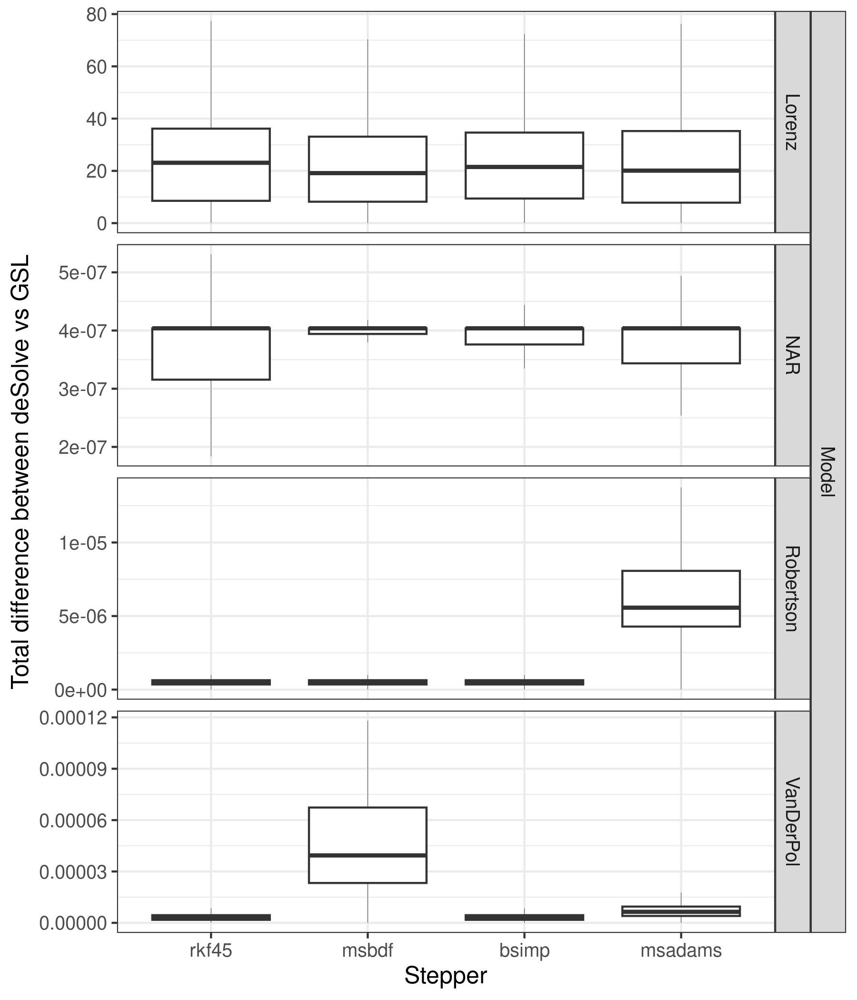

# gslODE
Tests for GSL ODE solver implementation

This repo implements four ODE systems
- Negative autoregulation (NAR), a common gene regulatory network motif
- The Lorenz system, a highly chaotic weather model
- The Robertson problem, an extremely stiff ODE system modelling chemical kinetics
- The Van Der Pol oscillator, an oscillating ODE

and tests four different stepper functions
- Explicit embedded Runge-Kutta-Fehlberg (4, 5) method (rkf45)
- Implicit Bulirsch-Stoer method of Bader and Deuflhard (bsimp)
- Variable-coefficient linear multistep Adams method in Nordsieck form (msadams)
- Variable-coefficient linear multistep backward differentiation formula (BDF) method in Nordsieck form (msbdf)

I ran performance tests on a AMD Ryzen 7 5800HS @3.2GHz with the test app compiled with -O3 via gcc. Each model was run from time 0 to 100, with measurements taken every 0.01 units.

I measured performance across 100 replicate runs at two absolute error targets:


And across many error targets:


Stepper performance was dependent on the system, but in general was fast (apart from msadams, which was slow across the board, although fairly stable in performance across all models except the NAR - perhaps for larger systems it might compare better?)

We also measured solution similarities vs the R ```LSODA``` solver implemented in ```deSolve```:


With each output being one of the solutions for the ODE.
The total difference across all equations is given below:




Solutions were similar across solvers, except for the Lorenz system which is extremely chaotic and known to be sensitive to solver choice (so not surprising).

Overall, the tests show the GSL library produces comparable results to deSolve in most cases, and with considerable performance advantages. It should be a fine inclusion into SLiM. 


## SLiM Implementation

The Eidos API is proposed as

```
object<DataFrame>$ solveODESystem(s system, numeric initialValues, numeric parValues, numeric maxTime, numeric measureInterval, [s stepper = "rkf45"], [f epsRel = 1e-10], [f epsAbs = 1e-10], [Dictionary jacobian = NULL])

```

<p class="p3"><span class="s5">Solves a system of <b>first-order ordinary differential equations</b> from time 0 to maxTime, specified by system with starting conditions initialValues and parameters parValues. Outputs are measured in intervals of measureInterval.</span> Returns a dataframe with columns id for the current solution index, t for the current solution time and a column for each variable. id is meaninful only when initialValues and parValues are matrices (see below).

Available systems are "polynomial" for a polynomial equation of form <i>dx/dt</i> = a<sub>n</sub>x<sup>n</sup> + a<sub>n-1</sub>x<sup>n-1</sup> + ... a<sub>2</sub>x<sup>2</sup> + a<sub>1</sub>x + a<sub>0</sub>, "simplereg" for a simple gene regulation model <i>dX/dt</i> = β - αX, "+Hillregulation" for a positive Hill function gene regulation model <i>dX/dt</i> = βX/(K<sup>n</sup>+X)-αX, "-Hillregulation" for a negative Hill function gene regulation model <i>dX/dt</i> = K<sup>n</sup>/(K<sup>n</sup>+X)-αX, or an eidos string for a user-defined system.</p> <p>Available steppers are "rkf45" (the default), for a Runge-Kutta-Fehlberg (4, 5) stepper, "bsimp" for an Implicit Bulirsch-Stoer method, "msadams" for a variable-coefficient linear multistep Adams method in Nordsieck form, or "msbdf" for a variable-coefficient linear multistep backward differentiation method in Nordsieck form.</p><p>Note that usage of custom requires SLiM to build and include Tiny CC via the flag -DBUILD_TINYCC=TRUE. Instructions are available in the manual.</p>
<p>epsRel and epsAbs determine the relative and absolute acceptable error for each step. If the solver cannot attain this error, it will reduce the step size and try again.</p>
<p>initialValues and parValues may be supplied as vectors or as n*m and n*k matrices, where n is the number of different initial value/parameter values to evaluate, m is the number of solutions, and k is the number of parameters. When initialValues and parValues are matrices, the output id column refers to the row number in these matrices. When system, maxTime, measureInterval, stepper, epsRel, and/or epsAbs are length n, each value will be applied according to each solution. When these values are singleton, they are applied across all solutions.</p>
<p>Polynomial, simple regulation, and Hill Function systems have one solution output; when using these systems, initialValues should either be singleton, or length n. Polynomial systems have p parameters, where p is the order of the polynomial plus one (e.g. a quadratic function would have p=2+1=3). Hence, parValues should either be length p or a n * p matrix. Parameters should be input in decreasing order (a<sub>n</sub>, a<sub>n-1</sub>, ... a<sub>0</sub>). Simple regulation has two parameter values, α and β, and should be length 2 or a n * 2 matrix. Hill function systems have 3 parameters, α, β, and K, and should be length 3 or a n * 3 matrix. Parameters should be input in the order given here.</p>
<p>Optionally, a Jacobian matrix can be supplied. This is required for the steppers bsimp and msbdf. When initialValues and parValues are matrices, the Jacobian should be supplied as a Dictionary of matrices, with each key representing the row in initialValues/parValues that the matrix should be solved with, and the values being the matrices.</p>
<p>User-defined systems should separate each equation with a new line. All equations should begin with dydt[x], where x is a positive integer starting from 0 going to the maximum value. Parameters should be specified with p[x] subsetting syntax. parValues should be filled with values as per the equation (e.g. the value p[0] in the expression should be the first value in parValues). Variables should be expressed as y[x]. initialValues should be filled in the order specified (e.g. the value y[0] and dydt[0] should correspond to initialValues[0]). An example expression for the Lorenz system is
"dydt[0] = p[0] * (y[1] - y[0])<br>
dydt[1] = y[0] * (p[1] - y[2]) - y[1]<br>
dydt[2] = y[0] * y[1] - p[2] * y[2]"
</p>


-- End docstring --
